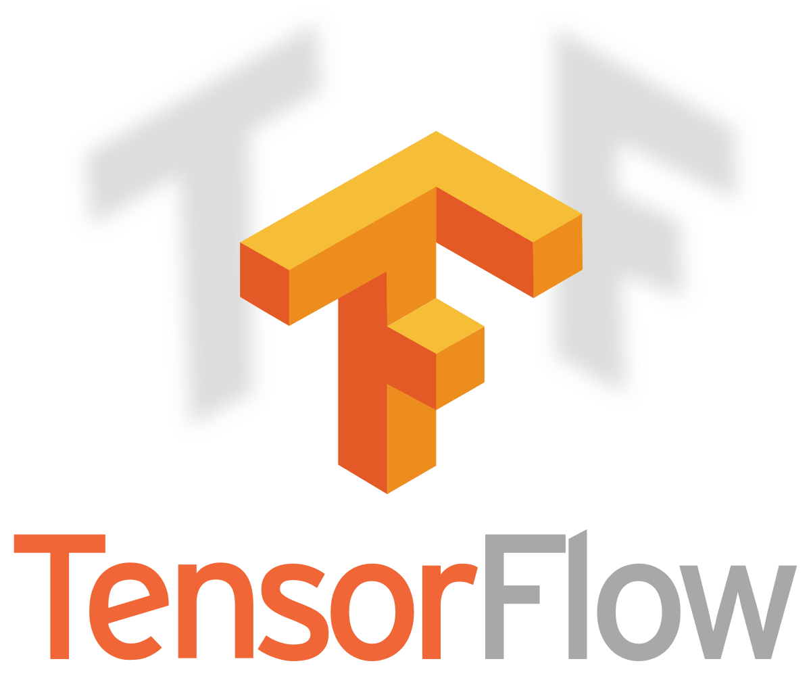

# TensorFlow Basics Tutorial

This Jupyter notebook provides an introduction to TensorFlow basics and demonstrates how to build a simple regression model using TensorFlow and Keras.

## Contents

1. Introduction to TensorFlow Basic Syntax
2. Creating Tensors
   - Constant Tensors
   - Variable Tensors
   - Ragged Tensors
   - Sparse Tensors
3. Tensor Operations
4. Building a Simple Regression Model

## Key Features

- Introduction to TensorFlow data types and operations
- Demonstration of various tensor types (constant, variable, ragged, sparse)
- Step-by-step guide to building a regression model using TensorFlow and Keras
- Visualization of model performance and training history

## Requirements

- TensorFlow
- NumPy
- Matplotlib
- scikit-learn

## Usage

1. Ensure you have Jupyter Notebook or JupyterLab installed.
2. Install the required libraries: `pip install tensorflow numpy matplotlib scikit-learn`
3. Open the notebook in Jupyter and run the cells sequentially.

## Model Architecture

The regression model consists of:
- Input layer
- Two hidden layers with ReLU activation (64 and 32 units)
- Output layer (1 unit)

## Results

The notebook demonstrates:
- Creating and manipulating tensors
- Building and training a regression model
- Evaluating model performance
- Visualizing actual vs predicted values
- Plotting training and validation loss

## Note

This tutorial is designed for beginners to intermediate users of TensorFlow. It covers basic concepts and provides a foundation for more advanced deep learning projects.